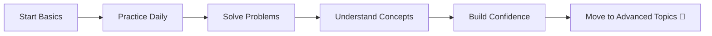

# 🐍 Python Basic Exercises

### *Build a Strong Foundation in Python Programming*

<p align="center">
  
</p>

<p align="center">
  
  
  
  
</p>

---

## 📖 About This Repository

<p align="center">
  
</p>

This repository is a curated collection of **Python basic exercises** designed to help you:

* 🧠 Master core programming concepts
* ⚡ Develop logical thinking
* 🚀 Build a solid base for **Machine Learning & AI**

> 💡 *Small steps every day lead to big results.*

---

## 🧠 What You Will Learn

---

### 🔹 Core Concepts

<p>
  
  
  
</p>

* Variables & Data Types
* Input / Output Handling
* Type Casting

---

### 🔹 Control Structures

<p>
  
</p>

* Conditional Statements (`if`, `elif`, `else`)
* Nested Logic
* Boolean Operations

---

### 🔹 Loops & Iteration

<p>
  
</p>

* `for` loops
* `while` loops
* `break`, `continue`

---

### 🔹 Functions

<p>
  
</p>

* Function creation
* Parameters & return values
* Lambda basics

---

### 🔹 Data Structures

<p>
  
</p>

* Lists
* Tuples
* Sets
* Dictionaries

---

### 🔹 Strings

<p>
  
</p>

* String methods
* Formatting
* Pattern problems

---

### 🔹 File Handling

<p>
  
</p>

* Reading files
* Writing files
* Text processing

---

## ⚡ Learning Workflow



---
---

## ▶️ Getting Started

<p align="center">
  
</p>

```bash
git clone https://github.com/your-username/python-basic-exercises.git
cd python-basic-exercises
python filename.py
```

---

## 🎯 Progress Mindset

<p align="center">
  
</p>

---

## 🌟 Future Improvements

* 🔹 Intermediate challenges
* 🔹 Mini projects
* 🔹 Real-world problems
* 🔹 AI-focused exercises

---

## 🤝 Contributing

<p align="center">
  
</p>

Contributions are welcome!

* Add new exercises
* Improve solutions
* Optimize code

---

## ⭐ Support

If this helps you:

* ⭐ Star the repository
* 📢 Share with others
* 💻 Keep coding daily


